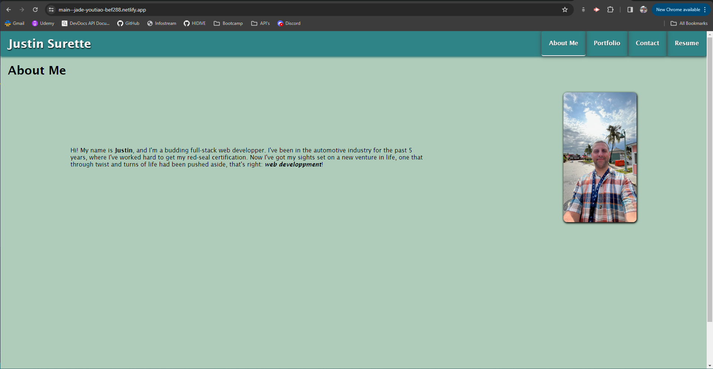
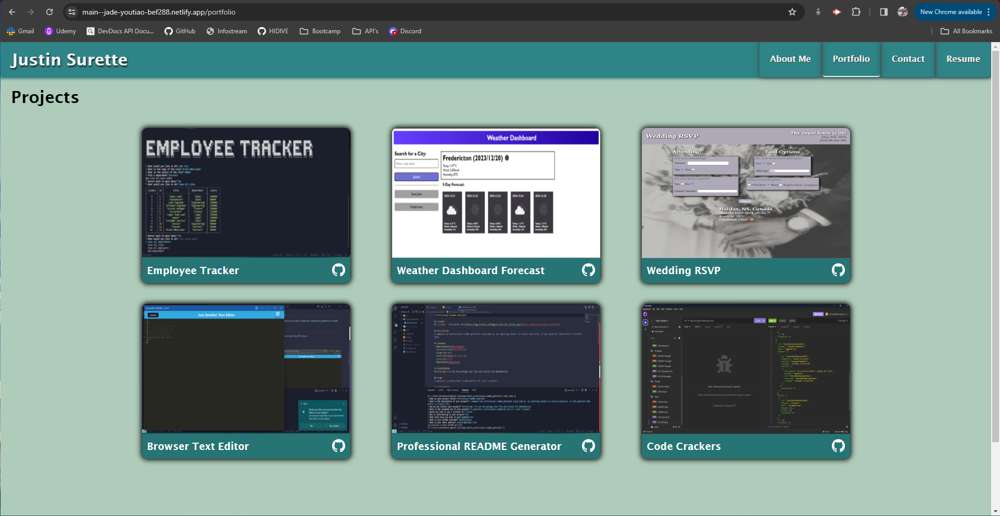
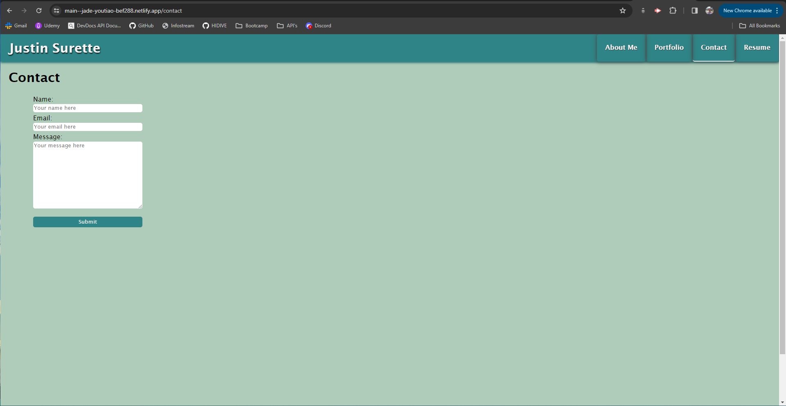
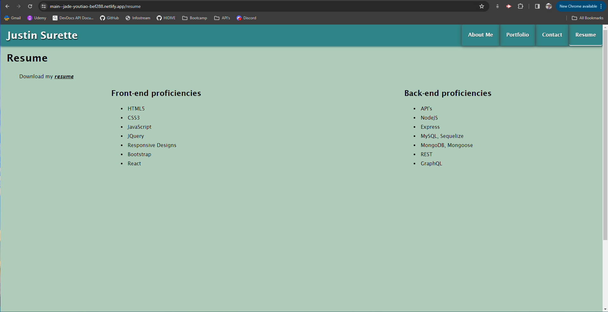
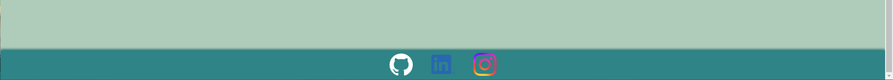

# Personal Portfolio

## Overview

This project is a single-page application portfolio for web developers using react + vite, designed to showcase their work and provide essential information for potential employers. The portfolio is built using React, highlighting the developer's experience in building single-page applications.

## Features

### 1. Page Structure

- The portfolio presents a clean and organized structure with a header, content section, and footer.

### 2. Header

- Displays the developer's name.
- Navigation with titles corresponding to different sections: About Me, Portfolio, Contact, and Resume.

### 3. Navigation

- Titles include About Me, Portfolio, Contact, and Resume.
- The current section's title is highlighted.
- Clicking on a navigation title updates the content section without reloading the page.

### 4. Default Selection

- Upon the initial load, the About Me title and section are selected by default.

### 5. About Me Section

- Includes a recent photo or avatar of the developer.
- Provides a short bio about the developer.

### 6. Portfolio Section

- Displays titled images of six applications.
- Links to both the deployed applications and corresponding GitHub repositories.

### 7. Contact Section

- Features a contact form with fields for name, email address, and message.
- Provides notifications for required fields and invalid email addresses.

### 8. Resume Section

- Includes a link to a downloadable resume.
- Lists the developer's proficiencies.

### 9. Footer

- Presents text or icon links to the developer’s GitHub and LinkedIn profiles.
- Includes a link to the developer's profile on a third platform (Instagram).

## How to Run

1. Clone this repository.
2. Navigate to the project directory.
3. Run `npm install` to install dependencies.
4. Run `npm start` to start the development server.
5. Open your browser and go to `http://localhost:3000`.

## Technologies Used

- React
- HTML/CSS
- JSX

## Author

XenodiusAlpha
GitHub repository: https://github.com/XenodiusAlpha/personal_Portfolio
Netlify Deployment: https://main--jade-youtiao-bef288.netlify.app/

## Screenshots

## License

This project is licensed under the [License Name] - see the [LICENSE.md](LICENSE.md) file for details.